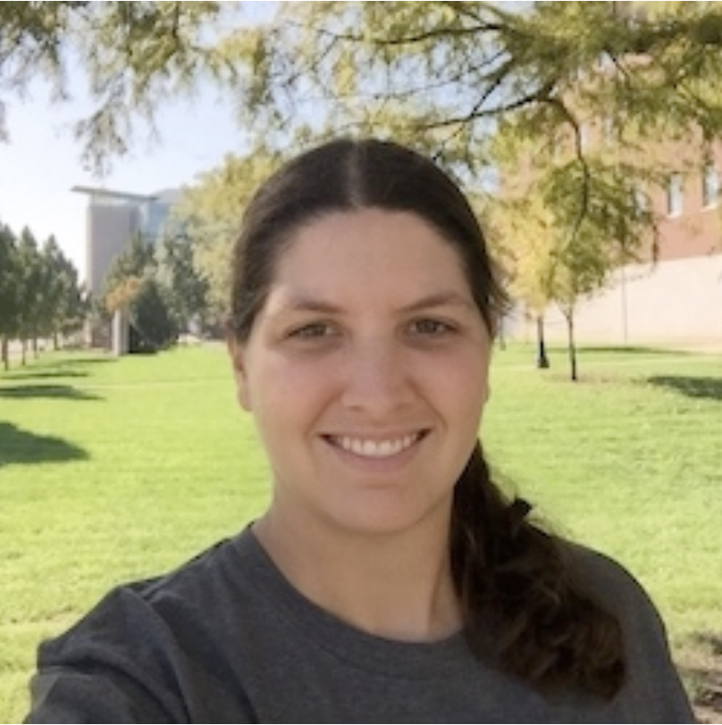
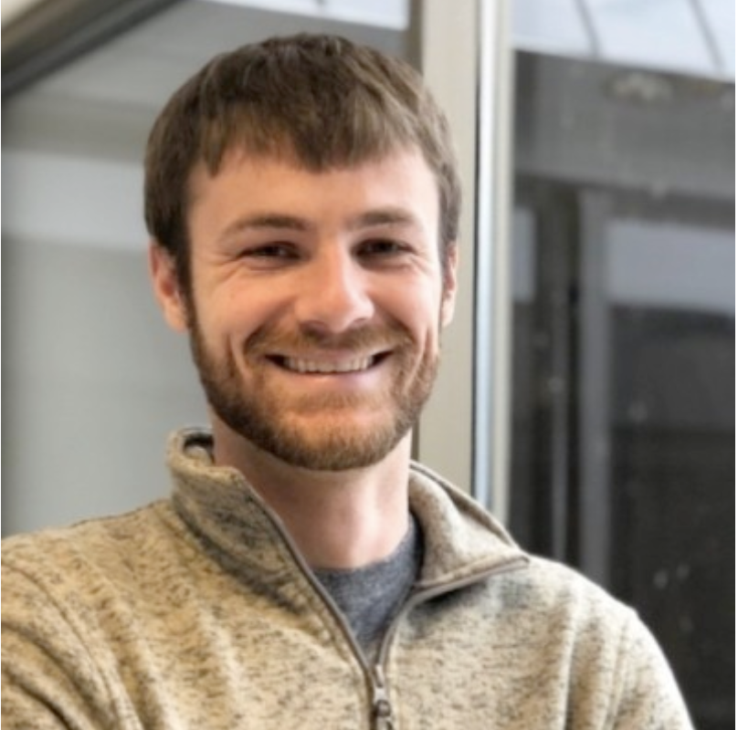
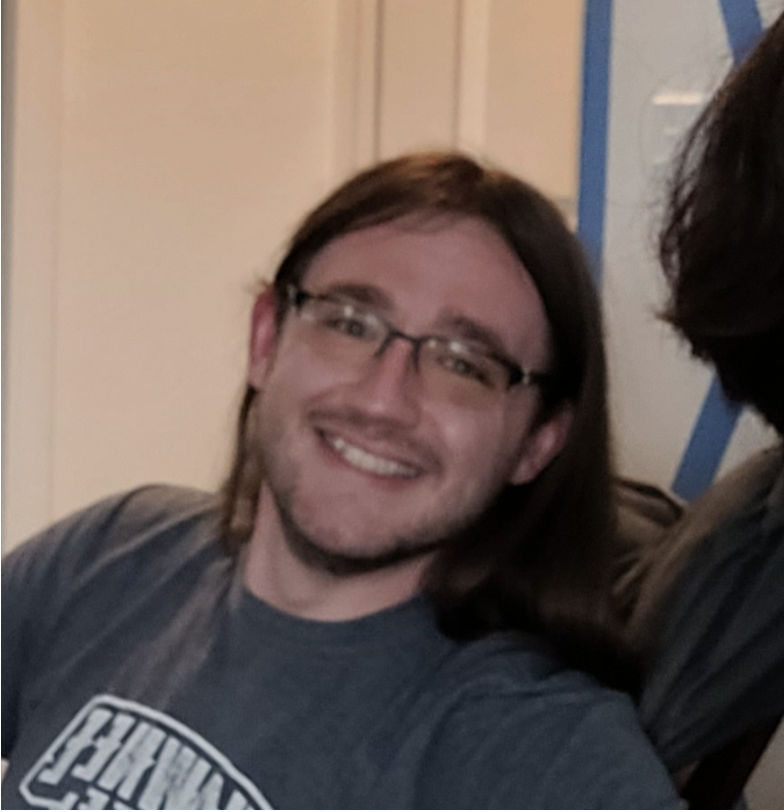
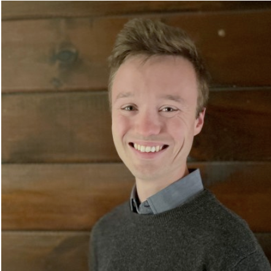
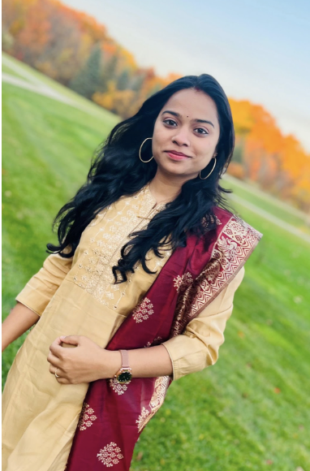
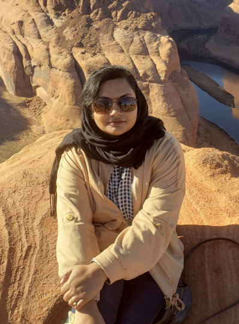
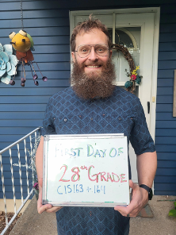
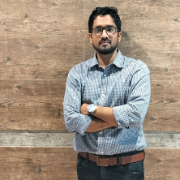
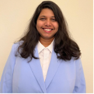

# CIS 163 - Computer Science II - Winter 2026
# Section 01
# GVSU College of Computing

## Instructor Information

Instructor:  Erin Carrier

Office: C-2-211 MAK

Phone:  (616) 331 - 2439

Email:  [erin.carrier@gvsu.edu](mailto:erin.carrier@gvsu.edu?subject=[CIS162])

Office Hours:
- Wednesdays 10am - 12pm (in Computing Success Center)
- Feel free to drop in any time my office door is open
- Reach out if you want to meet at a different time

Python Wave Study Group:
- Tuesdays 4:00pm - 6:00pm
- Fridays 3:00pm - 5:00pm
- Both in Computing Success Center MAK A-1-101)

## Catalog Course Description

Programming methodology, design and analysis of algorithms, and an introduction to data structures. Examples from a wide range of computing applications will be discussed.

Prerequisites: MTH 122 or MTH 124 or placement into MTH 201 or above through Grand Valley math placement, and a C or better in either CIS 159 or CIS 162.

## Why Take This Course?

Computational thinking is a critical skill to develop whether you are pursuing a career in a computing field or simply pursuing your own curiosity. We will explore problem solving strategies and algorithmic thinking that develop your logical reasoning. You will gain proficiency in object-oriented design and see different application areas for programming. These words all sound great, but what do they mean for you? Over the course of this semester, you'll be building critical thinking and problem solving skills to process a problem, break it down into its constituent parts, and craft a solution. Building these skills and learning a language (both programming language and terminology) in which to carry out this process is the ultimate goal of this course
.
## AI Use Policy

The introduction of LLM code tools such as GitHub CoPilot and ChatGPT are actively changing how software is developed.  In just the past two years we’ve seen these tools widely adopted across industry and many stories about the nature of coding work changing.  While that is the case, the most crucial skills that employers desire are critical thinking and problem solving.  Jobs of the future will still require graduates who have the ability to break down and solve complex problems.  Although the apparent focus in this course is on essential programming skills, you are beginning a journey to see the world through a computational lens.  While you will use AI tools in your future work, it won’t replace a human problem solver.  Considering this reality, you are allowed to use AI as a tool to assist you when completing your programming projects.  However, they must be used as a tool; you are not allowed to use them to replace thinking.  When AI is permitted, you will be required to upload your transcripts.  You are always expected to fully understand the work you submit.  If you choose to use AI, be warned:  you must complete the exams without the use of AI tools and you must do sufficiently well on the exams in order to pass the course.  I will work with you all in class to explore what it means to be able to read code, understand code, and troubleshoot.  As we navigate this journey, I want you to know from the start the importance of developing your own coding literacy while also being able to effectively leverage AI tools.

## Help - Academic Support and Tutoring

This course requires patience and persistence as computational thinking/programming is a craft.
It will likely be challenging.
We are committed to your success and want to be your first source for help. 
Please ask questions before, during and after class as well as visit during office hours.
I personally have an open-door policy: you are free to drop in anytime my office door is open or reach out to set up a separate meeting time.
Beyond your instructor, the Computing Success Center is a great place to find help. 
Free drop-in tutoring for CIS 163 is available during specific hours during the week but it is also a great space to hang out and work with others on group work!
See [Computing Success Center](https://www.gvsu.edu/computing/student-success-center-13.htm) for a current schedule.
You can also contact the [GVSU tutoring center](http://www.gvsu.edu/tc/) for one-on-one tutoring.

## Faculty Support Team

|||
|----------|---------------------------------------------------------------|
|          | Professor Ira Woodring believes that computing knowledge should be accessible for all people.  He thrives on seeing students learn, and enjoys the challenge of teaching diverse groups of learners.  His research focuses on creating accessible computing solutions for persons with disabilities.  He is an avid gamer, and loves playing (and creating) video games with his four children.   Office: MAK D-2-238 |
|           | Professor Erin Carrier leads 3C, the peer mentorship program in the College of Computing.  She is passionate about undergraduate research and is Chair of the University Undergraduate Research Council.  Her research is in the areas of numerical methods, scientific computing, high-performance computing, machine learning, data science, and CS pedagogy.  She loves snow skiing, scuba diving, wakesurfing, stand up paddleboarding, reading, playing video and board games, and spoiling her dogs Chewie and Coral.  She’s also a GVSU alum (2013 BS in CS). Office: MAK C-2-211  |
|          | Professor Jared Moore has been at GVSU 9 years.  He also teaches Computer Architecture and Artificial Intelligence.  His research is in the area of evolutionary robotics and evolutionary art with collaborators Professor Fredericks (GVSU), Dr. Anthony Clark (Pomona College), and Dr. Adam Stanton (Sheffield University, UK).  Outside of computing, he is a runner, fly fisher, hockey goalie, and enjoys hiking with his wife and dog.    Office: MAK C-2-118 (In the Computing Dean’s Suite, MAK C-2-100) |
|           | Professor Austin Ferguson (who often goes by Dr. Ferg), is starting his second year teaching at GVSU. His teaching (and just his life, generally) centers seeing students as humans first and asking how we can better help them achieve their goals (while teaching them cool stuff along the way!). His research uses computational systems to test evolutionary theory. He loves to be outside, making/playing video games, and capybaras. He thinks he could take Professor Woodring in most video games, but has no evidence to back this up (yet).   Office: MAK C-2-216 |
|           | This is Professor Paul Fink’s first year at GVSU and he is thrilled to be here! He brings to the classroom a background in student support, academic advising, and a strong commitment to success at each step along the way. His research explores new interfaces to support accessibility in transportation and mobility, with application areas including self-driving and autonomous systems. When not at work, he plays lots of games (talk to him about 4x, grand strategy, and RPGs) and instruments. He also loves being outside with his wife, kid, and two doggos. Office: DCIH 530K |
|  |Professor Charitha believes that learning to code should be approachable and empowering for every student. She enjoys helping beginners gain confidence in problem solving and loves seeing the moment when a new concept “clicks.” Her background is in health informatics and bioinformatics, where she applies computing to improve healthcare outcomes and analyze biological data. Outside of teaching, she enjoys creating artwork, and is currently working on mandala art, which allows her to explore creativity and balance in a different way.  Office: MAK-C-2-311 |
|   | Professor Romena Yasmin has been at GVSU for almost a year now. Her research focuses on how people and machines can team up together to make fairer and smarter decisions (fingers crossed – it’s still a work in progress!!). In her research she combines ideas from computational social choice, operations research, and machine learning to tackle problems ranging from improving group decision-making to crowdsourcing solutions. Outside of her work, she is passionate about art, she loves painting with acrylics and oils and has a deep interest in art history. She jokes that she could happily spend an entire week exploring museums on her own.  Office: MAK-D-2-142 |
|   | Professor Kevin Maupin (Maw-pin) is loving his first year as a professor at GVSU. He brings to the classroom a background in biology, biomedical research, and applied data-driven problem solving, with experience spanning academic research, clinical collaboration, and industry. His work has included studies in bone biology, cancer, molecular imaging, and theranostics, as well as more recent efforts at the intersection of healthcare and AI. Kevin is passionate about helping students build confidence in technical skills while learning how to apply them to real-world problems. He values curiosity, collaboration, and persistence, and aims to create a supportive and inclusive classroom environment. Outside of work, he enjoys running, hiking, and mindfulness practices, and is always interested in how health, lifestyle, and technology intersect. He’s also a GVSU alum (2010 BS in Cellular and Molecular Biology).  Office: MAK-C-2-313 |
|   | Professor Imtiaz Ahmad has been at GVSU for almost three years now. His research explores how people interact with emerging technologies - from smart speakers in shared spaces to the ways users develop relationships with AI systems and assign them moral standing. He values hands-on learning, evidence-based teaching improvements, and creating an inclusive environment. Outside of his work, he enjoys watching soccer and football.  Office: MAK-C-2-210 |
|   | Professor Tejaswi Manchineella(as the name is complicated, goes by Ms. T) has been working at GVSU since 2023. Before that, she worked as a Software Developer for 5 years. Her teaching goal is trying to help students understand the concepts using real-time examples. She believes strongly in Learning should be Fun. She loves to go on walks, camping, and watching sunsets.   Office: MAK C-2-312 |

## Learning Objectives

After completing this course, students should be able to:

- Develop good quality programs in Python
- Manipulate fundamental data structures: lists (arrays), strings, linked lists, stacks, and queues.
- Solve problems using object-oriented principles (inheritance, polymorphism, abstract and interface classes, containers/collections, and iterators).
- Use UML class diagrams to represent the design of object-oriented programs.
- Analyze the run-time performance of algorithms using Big-O notation.
- Use appropriate tools for development (editor, debugger, etc.).
- Interpret technical programming documentation (Python API).

## Learning Management System

Course documents, videos, assignments, grades, links, and announcements will be posted to Github.  Labs and projects will be posted and completed on PrairieLearn.  It is your responsibility to stay informed.

## Programming Language and IDE

This courses uses [Python](https://www.python.org/downloads/).  We use [VS Code](https://code.visualstudio.com/) as the free development tool.

## Textbooks / Resources

In order to keep costs low, we will be using a variety of free online resources to introduce you to the Python programming language. Our text will be
Python Object-Oriented Programming - Fourth Edition, Steven F. Lott, Dusty Phillips
This book is freely available from O'Reilly through a GVSU subscription. You may access the book by going to [https://www.oreilly.com/library-access/](https://www.oreilly.com/library-access/). From there,

* Click the "Institution not listed" link
* Enter your GVSU email
* Click "Let's Go"
* Search for the book listed above

This course is not designed to be a lecture-only format, but rather an active learning community. For this to work, we expect you to read the assigned sections from the text (listed in the schedule) before coming to class. Questions from those sections will appear in class activities and on exams.

## Lab Activities

Our class meets each week for two hours in a computer lab. Attendance in lab is strictly required and half of your lab grade is based on attendance. To receive credit for attending, you must show up reasonably on-time and stay for the entire lab or until you finish the lab using your own work (e.g. simply dropping the entire lab into AI and attempting to leave will not receive credit). You will be given an activity that must be completed before the next week’s lab. You will work with a lab partner each week. This approach is called pair programming and is often used in industry to make the process more productive and enjoyable.

## Programming Projects

Projects are completed on your own time outside of class. The three projects increase in complexity as your abilities improve.  You will need to start early and budget enough time to complete the projects. 

While a certain amount of consultation between students working on a project is encouraged, the work you submit must be your own. Do not create a difficult situation by representing someone else's work as your own.  Make sure you cite your resources. For more information, consult the [Student Code](https://www.gvsu.edu/policies/category.htm?categoryId=2D0C8EF7-9959-9B01-959C403E725313F3), and the [College of Computing Guidelines for Academic Honesty](https://www.gvsu.edu/computing/academic-honesty-30.htm).

## Classroom Activities / Attendance

Students learn best when attending class regularly. As such, attendance in class is required. You are expected to attend and actively participate in class, and this will count for part of your grade. To receive credit for attendance and participation for a particular day, you must be in class, actively engaging, and complete any in-class activities.

In-class activities will often utilize peer instruction and be group activities tied to course content. These group activities have shown to be effective at increasing student motivation, academic performance, and attendance. Some in-class activities, paired or individual, may be required to be turned in, whereas others may be graded purely based on being in-class and completing them.

## Midterm Exams

You will take two midterm exams in-class during lab to demonstrate your understanding of key concepts and problem-solving skills.  You are allowed one 3x5 notecard of handwritten notes on the exam.  No magnifying glasses allowed, so it must be written large enough for you to read 🙂.  Other than that notecard, the midterms are closed-book/closed-note and you are not allowed to use any smart devices.

## Lab Exam

You will complete a lab exam towards the end of the term.  This is your opportunity to demonstrate your abilities working alone at a computer during the regularly scheduled lab session.  The lab exam is open notes and open book.

## Final Exam

A common final exam is taken by all CIS 163 sections on the Saturday afternoon before final exam week – **April 25th 1:00 - 3:00 pm.**

## Exam Retakes
You will have the opportunity to retake your midterm exams and the lab exam. If you choose to retake your exam, your overall exam score will be computed as a weighted average of the two scores, with the higher score weighted more heavily. More specifically, your overall score for that exam will be 0.15*lowerscore + 0.85*higherscore. Retake exams will cover the same general content as the original exam and be designed to be roughly the same difficulty, but the questions will be different. Retake exams will be taken out of class during available time slots spread over two days. You will need to sign-up to retake the exam for a time slot that works for you.

No retakes will be permitted on the final exam.

## Course Policies

- **You must earn a combined average of at least 60% between the midterm exams, lab exam and final exam to pass the course.**
- All programming projects, unless otherwise specified by the instructor, are to be completed individually. Students are encouraged to work with each other for general help only.
- Projects and labs turned in late occur a penalty of 10% per day, up to 3 days late.  In general, projects and labs turned in more than 3 days late will not receive credit.  Life happens, if you have extenuating circumstances, please talk with me.  
- Attendance is required.  You are allowed to miss up to 2 days of class without penalty.   If you attend the Success Center for at least 8 unique weeks during the semester, you are allowed to miss one additional day of class (you must check-in and stay for a minimum of 30 minutes).
- The instructor reserves the right to modify course policies, the course calendar, and due dates with sufficient notice via email and in-class announcements.

## Grading

|          |          |
|----------|----------|
| Programming Projects (1-3) | 6%, 6%, 6% |
| Lab Assignments | 15% |
| Midterms (1 and 2) | 13%, 13% |
| Lab Exam | 13% |
| Final Exam | 15% |
| Class Attendance / Participation | 10% |
| Project Code Review | 3% |

# Grading Scale

> You must earn a combined average of at least 60% on the four exams (midterms, lab and final) to pass the course.

|          |          |          |          |
|----------|----------|----------|----------|
| A        | 93%      | C        | 73%      |
| A-       | 90%      | C-       | 70%      |
| B+       | 87%      | D+       | 67%      |
| B        | 83%      | D        | 60%      |
| B-       | 80%      | F        | Below 60% |
| C+       | 77%      |          |          |

## Academic Honesty

All students are expected to adhere to the academic honesty standards set forth by Grand Valley State University. In addition, students in this course are expected to adhere to the academic honesty guidelines as set forth by the School of Computing and Information Systems, details can be found at [College of Computing Academic Honesty](https://www.gvsu.edu/computing/academic-honesty-30.htm).

I believe that you can learn a lot from your peers, both in the class and in the broader community. Therefore, I encourage collaboration with both.  However, do not mistake this as a license to cheat.   It is one thing to learn from and with your peers, it is another to pass their work off as your own.   With respect to writing code for this class:

* You are expected to document any collaboration that takes place.
* No electronic transfer of code between students is permitted.
* Any code that you find on the Internet must be cited, with an active link to that code. 
* While you are encouraged to engage in conversations in online forums, do not post solutions or solicit others to complete your work for you.
* Ultimately, you are responsible for all aspects of your submissions.  You should **be able to explain and defend** your submission if the work is entirely your own.

## Accessibility Support

Let me know if you have special needs and contact [Student Accessibility Resources (SAR)](https://www.gvsu.edu/accessibility/) at 616-331-2490.

## GVSU Course Policies

This course is subject to the GVSU policies listed at [GVSU Course Policies](http://www.gvsu.edu/coursepolicies/).

## In Case of Emergency

- Fire: Immediately proceed to the nearest exit during a fire alarm. Do not use elevators. 
- More information is available on the [University’s Emergency website](https://www.gvsu.edu/emergency/).
